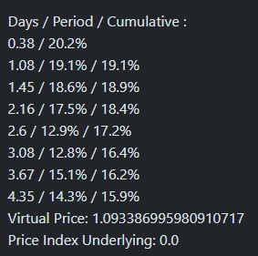

# Supply-Borrow Leveraged Vaults

Single token vaults are one of the most unique offerings at ACryptoS. We partner with and build on lending protocols, using our smart contract strategies to automatically leverage the same token.

By borrowing and supplying the same token in a number of loops, users earn Supply and Borrow APY multiple times, up to 7.6X the initial APY.&#x20;


Our strategy helps users get much higher yields for their tokens, and also increases the deposits and utilizations of lending markets.


There is zero liquidation risk in our strategy, as it is using the same token for supplying and borrowing. Price movements of the token do not result in liquidations. Understand how it works [here](../../dao/security-and-risks.md#risk-liquidation-risks).

## Vault Benefits

1. auto-Compounding\
   \- vaults compound automatically through our smart contract strategy\
   \- staked tokens increase over time
2. no IL (impermanent loss)\
   \- single token staking, no impermanent loss as per LP farming
3. automated, no harvesting required\
   \- APY is in staked tokens, not from farming emission tokens
4. safety-first\
   \- we filter and partner with quality protocols, putting our priorities on user fund safety\
   \- no security issues since 2020 launch

***

## Protocols

Vaults are built on the following protocols

* Venus (BSC)
* Moonwell (Optimism, Base, Moonbeam, Moonriver)
* Mendi (Linea)
* Lodestar (Arbitrum)
* Benqi (Avalanche) - sAVAX
* Stargate (Kava) - S\*USDt

***

## Vault Mechanisms

### receiptTokens

By depositing in any of these vaults, you will receive a receiptToken as proof of your deposit, in the form of acsXYZ. Eg. by depositing in a USDC vault, you will receive an acsUSDC token. When withdrawing from the vault, these tokens will be burned, and USDC will be redeemed to your wallet.

The number of receiptTokens in your wallet will not change upon every compound of the vault. Instead, the number of tokens that can be redeemed will increase.

### AutoCompounding

Our Single-token vaults compound automatically. The period between each compound depends on the TVL and APY of each vault. Higher TVL or APY usually triggers more frequent compounding, as the yields easily cover the fees and gas required for each compound.

By expanding the Advanced section, the Historical APY of the last 8 compounds are displayed in a section, showing the frequency and duration between each compound.

<figure><figcaption></figcaption></figure>

* Each line refers to one of the latest harvesting/rebalancing/compounding
* For the 8th line, it can be explained as:
  * the compound was 4.35 days ago
  * the APY achieved between 3.67 - 4.35 days ago is 14.3%
  * the Cumulative (Total) APY achieved between now and 4.35 days ago is 15.9%
* Virtual Price
  * The multiplier for the number of tokens in the vault that can be redeemed for each of the receiptTokens. eg. 1000 acsUSDC will redeem 1093.386995980910717 USDC.

### Leveraged Looping

These vaults stake recursively on the lending platforms at up to \~7.6X leverage, farm the rewards tokens and swap it for more of the initial deposited tokens.

When initially depositing, users may notice the value of their holdings in the vault **slowly decreasing on each block**.

This is normal because we are using leverage on the lending platform, and the borrow amount increases faster than the supply amount. Also the value of the farmed reward tokens are not included at the start.

The balance will increase once harvested rewards are included (after each harvest of the Vault).

Also, due to supplying and borrowing the same token, there are zero liquidation risks, as price movements do not affect the supply/borrow health ratio.


Resources: [Advanced Yield Farming Strategies on Venus protocol](https://medium.com/acryptos/advanced-yield-farming-strategies-on-venus-protocol-46a4044573fc) - by x.ACryptoS


## Advanced Functions

<figure><figcaption></figcaption></figure>

**"Reward"** amount refers to the number of vault tokens that a user will receive when the **"Harvest Vault"** function is triggered. These are called harvester fees (a set % of the pending rewards), with the % varied depending on different vaults _(0.03% in this case here)._ These fees serve as an incentive to compensate the gas fees used for compounding the vault.


Harvester rewards are received in the form of the vault acsXYZ token.


_This is also to ensure the sustainability of our vaults, where users will always have an incentive to keep the vault compounding in the long run as long as there is TVL and fees._

### Harvest Vault

The **"Harvest Vault"** function triggers a rebalance of the vault, by harvesting incentives, swapping them and compounding them back into the vault. The function also checks for the optimum leverage ratio based on the supply/borrow % of the token's market in the underlying lending protocol, rebalancing the leverage ratio as needed.


**Harvesting consumes gas fees.**

It is not required to press on the "Harvest Vault" function. Our automation processes will handle this in the back end.

Only do this if you want to earn the harvester fees, or if you would like to compound the rewards before exiting the vault.


### Trigger Rebalance

<figure><figcaption></figcaption></figure>

The **"Trigger Rebalance"** function checks for the optimum leverage ratio for this vault, and rebalances the supply/borrow loops as needed to achieve the highest APY for the vault. It works similarly to the "Harvest Vault" function mentioned above, except it does not trigger a harvest of fees or compound of the vault.

Harvesting consumes gas fees.


**Harvesting consumes gas fees.**

It is not required to press on the "Trigger Rebalance" function. Our automation processes will handle this in the back end.


